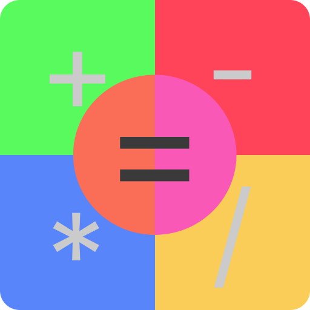

# Calc



A Calculator Desktop Application made with HTML, CSS, JavaScript and Tauri.

Built with 🤍 For You!

## Features

- Dark Mode
- Multiple Color Themes
- Basic Calculations
- Interactive Design
- Animations
- Decimal Operations
- Backspace Button
- Clear Screen Button

## Screenshots

### Editor


## Made using

- [HTML](https://www.w3schools.com/html/)
- [CSS](https://www.w3schools.com/css/default.asp)
- [JavaScript](https://www.w3schools.com/js/default.asp)
- [Tauri](https://tauri.studio/)

### Tools

- [Adobe Illustrator](https://www.adobe.com/in/products/illustrator.html?gclid=CjwKCAjwrfCRBhAXEiwAnkmKmW22TvR_yR5HsJU6LKlqymL7bsf2_JZPurewrpYvRR9I2H412N4x0hoCsd0QAvD_BwE&sdid=SBNHMR64&mv=search&ef_id=CjwKCAjwrfCRBhAXEiwAnkmKmW22TvR_yR5HsJU6LKlqymL7bsf2_JZPurewrpYvRR9I2H412N4x0hoCsd0QAvD_BwE:G:s&s_kwcid=AL!3085!3!248235017693!e!!g!!adobe%20illustrator!221172068!17525759228)
- [VS Code](https://code.visualstudio.com/)

### Some Websites Used

- [Favicon.io](https://favicon.io/)

## Concepts Used

- JavaScript Classes
- JavaScript Constants
- JavaScript Strings
- CSS Animations
- CSS Variables
- Tauri Desktop Application

## Run Locally

Clone the project

```bash
  git clone https://github.com/kushagra-aa/calc.git
```

Go to the project directory

```bash
  cd calc
```

Install dependencies

```bash
  npm i
```

Development Build

Runs the app in the development mode.

```bash
  npm run tauri dev
```

The App Window will automatically appear

or
Open [localhost:3000](http://localhost:3000) to view it in the browser.
